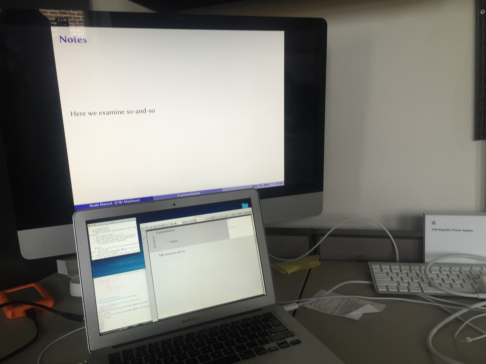

## Motivation
Beamer has nice features:

* videos
* notes
* (also, it's a *great* presentation tool)

Adobe has some great features to display a PDF:

* transitions
* video/animation
* hyperlinks

but I couldn't find a way to include presenter notes when displaying a PDF full
screen (i.e., Beamer presentation). I couldn't find any other software that
included all the niceties of Adobe *and* had note support so I created a
wrapper for Adobe.

This wrapper allows presentations in Adobe but also allows you to view the
notes you write with `\note{}`.

It does this by creating two PDFs and mapping your keypresses (arrows/etc) to
*both* open Acrobat windows.

This is not a big application; it only maps your keystrokes to both of Adobe
Readers windows. If it fails during a presentation, you can still survive!

## Latex compiling directions
I have provided a package so your presentation and notes have the same number
of slides.

0. Download this repo and copy `osx-adobe-beamer.sty` into the folder your
   presentation is in.
1. Include the line `\usepackage{osx-adobe-beamer}` before `\begin{document}`.
2. Compile your docuement with `\usepackage[notes]{osx-adobe-beamer}` and `\usepackage[slides]{osx-adobe-beamer}`. 
(I'm fairly certain this file must be included after beamer options (I did it
   before `\begin{document}` and was fine)
3. Copy the PDFs so you can open them both at once.

## Presentation directions
0. Download this repo.
1. Open up `notes.pdf` and `presentation.pdf` in Adobe Reader.
2. Run the command `python /path/to/present.py` in your terminal
3. Make the window that opens up active/in front.
4. Certain keys are now mapped to Adobe Reader! (arrows/space/return)

